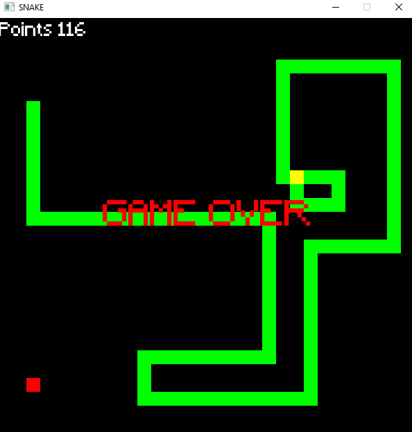

 

# SFML — Simple and Fast Multimedia Library
SFML is a simple, fast, cross-platform and object-oriented multimedia API. It provides access to windowing, graphics, audio and network. It is written in C++, and has bindings for various languages such as C, .Net, Ruby, Python.

# Screenshot

# Build
1. Download SFML from https://www.sfml-dev.org/download.php
2. Follow the instructions from this amazing tutorial https://www.youtube.com/watch?v=_VgRjlvGpPk&list=LL&index=29
3. Enjoy playing my game :)
